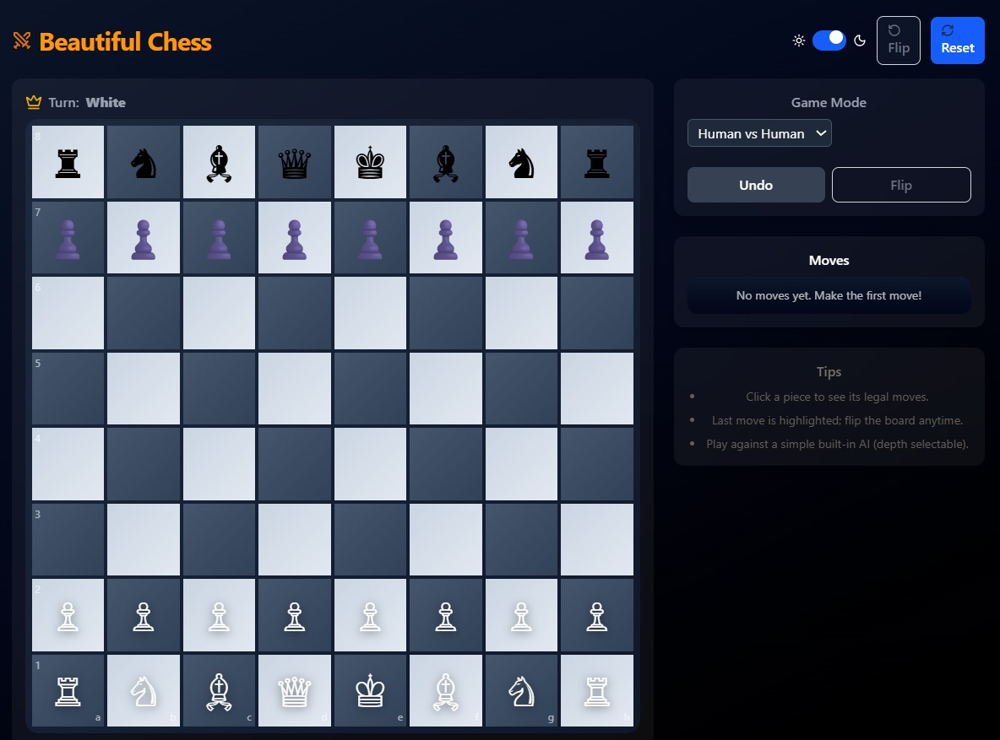

# ♟️ Beautiful Chess

A modern, responsive chess web application with AI gameplay and stunning animations.



## ✨ Features

- 🎨 **Beautiful UI** with light/dark mode toggle
- ♟️ **Interactive chessboard** – click a piece to see its legal moves
- 🔄 **Flip board** option for changing perspective
- ⏪ **Undo & Reset** game controls
- 🤖 **Human vs AI mode** – play against a built-in minimax AI with configurable depth (1–3)
- 👥 **Human vs Human mode** – two-player local gameplay
- 📜 **Move history tracking** with algebraic notation (SAN)
- 🏁 **Game status detection** – checkmate, stalemate, draw (threefold repetition, insufficient material, etc.)
- 📱 **Responsive design** – works across desktop and mobile

## 🚀 Tech Stack

- **[React](https://reactjs.org/)** with **[Vite](https://vitejs.dev/)** - Fast development environment
- **[Tailwind CSS](https://tailwindcss.com/)** - Utility-first CSS framework for styling
- **[shadcn/ui](https://ui.shadcn.com/)** - Beautiful UI components built on Radix UI
- **[Framer Motion](https://www.framer.com/motion/)** - Smooth animations for piece movement
- **[Lucide React](https://lucide.dev/)** - Clean and scalable icon library
- **[Chess.js](https://github.com/jhlywa/chess.js)** - Chess rules, move generation, and validation

## 🎮 Game Modes

### Human vs Human
- Classic two-player chess on the same device
- Perfect for playing with friends locally
- Full move validation and rule enforcement

### Human vs AI
- Play against a smart minimax AI opponent
- Configurable AI difficulty levels (depth 1-3)
- AI considers piece values, position, and tactics

## 📦 Installation

1. **Clone the repository**
   ```bash
   git clone https://github.com/shuvomdhar/chess-game.git
   cd chess-game
   ```

2. **Install dependencies**
   ```bash
   npm install
   # or
   yarn install
   # or
   pnpm install
   ```

3. **Start the development server**
   ```bash
   npm run dev
   # or
   yarn dev
   # or
   pnpm dev
   ```

4. **Open your browser**
   Navigate to `http://localhost:5173` to start playing!

## 🛠️ Available Scripts

- `npm run dev` - Start development server
- `npm run build` - Build for production
- `npm run preview` - Preview production build locally
- `npm run lint` - Run ESLint for code quality

## 🎯 How to Play

1. **Choose Game Mode**: Select between Human vs Human or Human vs AI
2. **Make Your Move**: Click on a piece to see its legal moves, then click on your desired destination
3. **Use Controls**: 
   - Flip the board to change perspective
   - Undo your last move if needed
   - Reset the game to start over
4. **Track Progress**: View move history in standard algebraic notation
5. **Win the Game**: Achieve checkmate, or watch for stalemate and draw conditions

## 🎨 UI Features

### Light/Dark Mode
Toggle between light and dark themes for comfortable play in any lighting condition.

### Responsive Design
Optimized for both desktop and mobile devices. Play on any screen size!

### Smooth Animations
Powered by Framer Motion, pieces glide smoothly across the board for a premium feel.

### Interactive Highlights
- Legal moves are highlighted when you select a piece
- Last move is clearly indicated
- Check and checkmate states are visually emphasized

## 🤖 AI Implementation

The AI uses a **minimax algorithm** with alpha-beta pruning:

- **Depth 1**: Quick moves, suitable for beginners
- **Depth 2**: Balanced gameplay with moderate thinking time
- **Depth 3**: Challenging opponent that looks several moves ahead

The AI evaluates positions based on:
- Material advantage (piece values)
- Positional considerations
- King safety
- Piece mobility

## 🎭 Chess Notation

The game uses **Standard Algebraic Notation (SAN)** for move history:
- `e4` - Pawn to e4
- `Nf3` - Knight to f3
- `O-O` - Kingside castling
- `O-O-O` - Queenside castling
- `Qxd8#` - Queen takes on d8, checkmate

## 🤝 Contributing

Contributions are welcome! Here's how you can help:

1. Fork the repository
2. Create a feature branch (`git checkout -b feature/amazing-feature`)
3. Commit your changes (`git commit -m 'Add some amazing feature'`)
4. Push to the branch (`git push origin feature/amazing-feature`)
5. Open a Pull Request

## 🐛 Bug Reports

If you find a bug, please open an issue with:
- Description of the bug
- Steps to reproduce
- Expected vs actual behavior
- Screenshots (if applicable)

## 📜 License

This project is for educational purpose.

## 🙏 Acknowledgments

- [Chess.js](https://github.com/jhlywa/chess.js) for the robust chess engine
- [shadcn/ui](https://ui.shadcn.com/) for the beautiful UI components
- [Lucide](https://lucide.dev/) for the clean icons
- The chess community for inspiration and feedback

## 📞 Support

If you have questions or need help:
- Open an issue on GitHub
- Check existing issues for solutions
- Join our discussions

---

**Enjoy playing Beautiful Chess! ♟️**

*Made with ❤️ and lots of ☕*